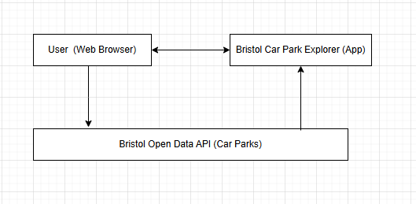

                                                     Bristol Car Park Explorer

Introduction

I am developing a small web application that uses the Bristol Open Data “Car Parks” dataset. The aim is to make a simple site using HTML, CSS and JavaScript that shows information about car parks in Bristol, such as how many spaces are available.

Business Case

Problem Statement:
Drivers in Bristol often struggle to find free spaces. The information that exists is sometimes unclear or hard to find. I want to build a simple web app that brings the data together in one place so users can see car park details easily

Aim
My aim is to build a basic and working website that shows real car park information from Bristol Open Data

Objectives
Connect to the Bristol Open Data API
Show car park names, total spaces, and available spaces
Use HTML, CSS and JavaScript only
Manage the code through GitHub
Follow all SDLC stages from planning to testing

Intended Users
People who drive or visit Bristol and want to see where car parks are available

Benefits
Helps users see car park information quickly
Uses real open data from the council
Gives me experience with connecting to an API and building a small system from scratch

Project Scope
In Scope:
Fetch data from the Bristol Open Data API
Display the car park data in a simple list or table
Allow users to refresh the data
Work on both desktop and mobile screens

Out of Scope:
No payment or booking feature
No user accounts
No advanced map integration

Assumptions and Constraints
 Type 	        Description 
 Assumption     The open data API remains available 
 Assumption     I can connect to the internet when testing the app
 Constraint 	I must use only HTML, CSS, and JavaScript 
 Constraint 	The project must be completed within the semester time
 Constraint 	HTML must pass the W3C validator

Risks and Mitigation

One risk is that the API could go offline. If this happens I will keep a local copy of the dataset (.json file) to continue testing
Another risk is having merge conflicts on GitHub, which I can avoid by committing changes often and using clear branch names
There is also a chance of falling behind schedule, so I will set weekly tasks and review progress. Browser issues are a low risk, but I will test the app regularly in Chrome to make sure it works

Return on Investment (ROI)
The project will not make money, but it will help me learn how open data APIs work and improve my front‑end coding and version‑control skills.

Context Diagram
This shows the basic interaction between the user, my web app, and the Bristol Open Data API.

The user opens the app
The app requests data from the Open Data API
The API sends back the JSON data
The app displays it on screen

Summary
In this stage, I planned what the project will do and what I need to build. The next step is to write the system requirements and use‑case diagram.