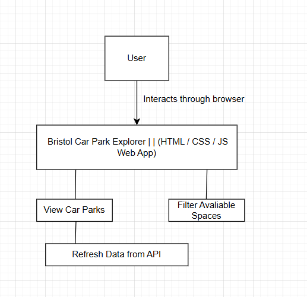

Introduction
In this stage, I describe what my web app needs to do. This includes the system requirements, how I expect users to interact with it, and how it will behave. The aim is to make sure I understand what must be built before I start coding.

User Stories:
As a driver I want to see all available car parks in Bristol so that I can find somewhere to park quickly
As a driver I want to filter car parks by area so that I can find parking close to where I need to be
As a driver I want to filter by availability so that I only see car parks that have free spaces
As a driver I want to refresh the data so that I can see the most up to date information

Actors
User – a person visiting the website through a browser to find car park information in Bristol.
Bristol Open Data API – the external system that provides car park data to the application.

Use Case Description
Main Actor
The main user is anyone who opens the web app in a browser to look for parking spaces in Bristol

System Goal
The system should show live information about Bristol car parks, using data from the Bristol Open Data API

Use Cases
View Car Parks: The user opens the app and sees a list of car parks with their names, capacities, and available spaces
Filter Available Spaces: The user can choose to show only car parks where spaces are available
Refresh Data: The user can click a refresh button to load the latest information from the API
Handle Errors: If the API is offline, the app will show an error message

UML Use Case Diagram
Below is a simple version written in text form to show the relationships:

Software Requirements Specification (SRS)

Functional Requirements:
The system will fetch car park data from the Bristol Open Data API
The system will display each car park’s name, total spaces, and available spaces
The system will refresh data when the user clicks the refresh button
The system will show an error message if the API is not available
The system will format and display data clearly using valid HTML 5

Non‑Functional Requirements:
The system will load and show data within a few seconds on a normal connection
The layout will work on both desktop and mobile screens
The interface will use good font contrast and readable colors
The code will be clean and commented so that it is easy to understand
All files will be stored and version‑controlled through GitHub

Data Requirements:
Input Data-JSON response from the Bristol Open Data API that contains car park details
Output Data-Car park information displayed on screen
No user data will be collected

System Requirements:
The app will run in any modern browser (Chrome, Edge)
The user only needs an internet connection
No installation or login is required

Assumptions and Limitations
I assume the API will stay available and that the data format will not change
The app is client‑side only, so if the API becomes unavailable, the app cannot update its data
I will not use frameworks like React or Vue since the project is limited to basic HTML, CSS and JavaScript

Acceptance Criteria

I will know the requirement is complete when:
The web page loads and shows car park information correctly
The refresh button updates the data from the API
The interface works on mobile and desktop browsers
No major validation errors occur in the HTML

Summary
In this stage, I identified what the system needs to do and defined both the functional and non‑functional requirements. I also described the main use cases and how the user will interact with the app.
The next stage is Design, where I will create wireframes and decide how the interface should look.