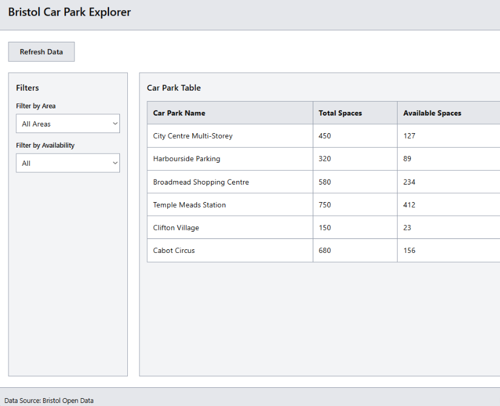
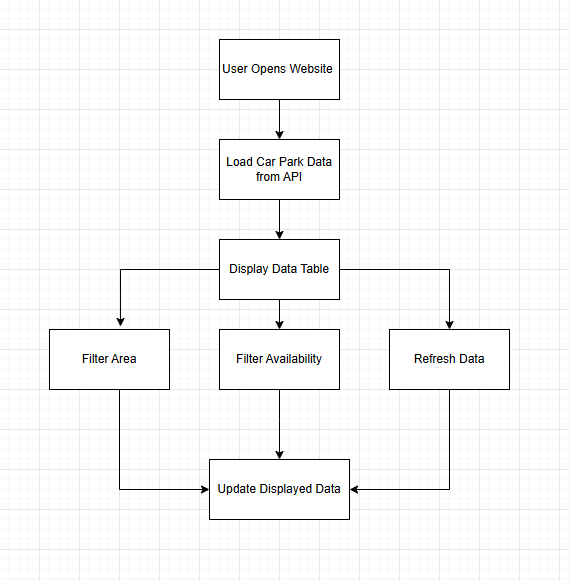
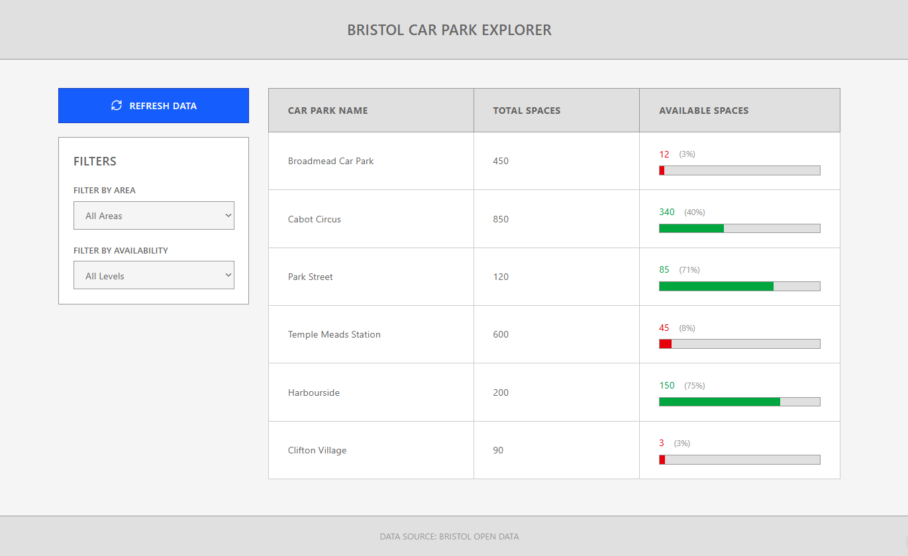

Introduction
In this stage, I designed how my Bristol Car Park Explorer web app will look and how users will interact with it. My main objective was to create a clear and simple interface that allows users to quickly view car park information from the Bristol Open Data API. The design focuses on usability, accessibility, and a single‑page layout that works well on both desktop and mobile devices.

User Interface Layout 

The application uses a single-page structure that displays information directly when opened  

Header: shows the title Bristol Car Park Explorer at the top of the page  

Action area: includes a “Refresh Data” button positioned near the top left so users can easily update the information from the API.  

Filter panel located on the left side of the page. This allows users to filter car parks by:
Area (All Areas dropdown)
Availability (All Levels dropdown)

Main section: displays car park data in a table format. The table includes:
Car Park Name  
Total Spaces  
Available Spaces  
Each row also includes a visual indicator (progress bar) to show how full the car park is.

Footer: contains a short message stating that the data is provided by Bristol Open Data.  

This layout separates filtering controls from the data display, making it easier for users to understand and interact with the system.

Colour and Typography Choices
The design uses a light colour palette with blue highlights for buttons and headings. The background is light grey or white for readability. I chose the Arial font for a modern and clean appearance.
Text is dark on a light background to maintain high contrast and meet accessibility standards

Responsive Design
I used a responsive design approach so that the app adapts to different screen sizes
On wider screens, car parks are displayed in a grid or table format showing multiple columns
On mobile screens, the data stacks vertically with larger touch‑friendly button

Flexbox or CSS Grid ensures that elements stay aligned and scale correctly

Accessibility and Usability
My main priority was to make the interface easy to read and navigate. Buttons have clear labels and enough spacing to use comfortably on touch screens. Text has strong colour contrast for readability
All headings follow HTML 5 structure, so they can be interpreted by screen readers
These decisions make the app suitable for a broad range of users
The filter panel is placed on the left to make it easy for users to quickly adjust what data is shown without losing visibility of the results

Layout Structure 
The page uses a two-collumn layout:
A left sidebar for filters and controls
A main content area for displaying car park data 
This structure improves usability by keeping controls separate from results.

Design Diagrams
The following design diagrams support the structure and visual planning of my project.

Wireframe

Presentation of the wireflow

Each diagram shows part of the design process:

Wireframe – basic page layout.
Wireflow – user interactions and movement through the interface.
High‑fidelity mock‑up – final presentation of colours, fonts, and spacing.
All design files are stored in the /diagrams folder within the repository.

Summary
In this stage, I created the design plan for the Bristol Car Park Explorer web app. I selected a simple layout, accessible colours and fonts, and a responsive grid to support clear data display. The design provides a solid foundation for building the working application in the next stage, Implementation.