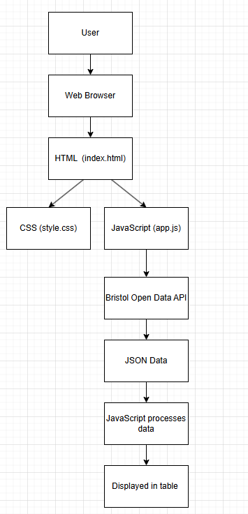
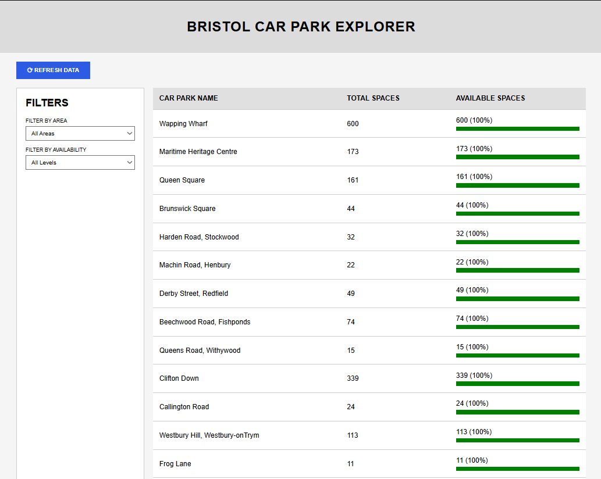
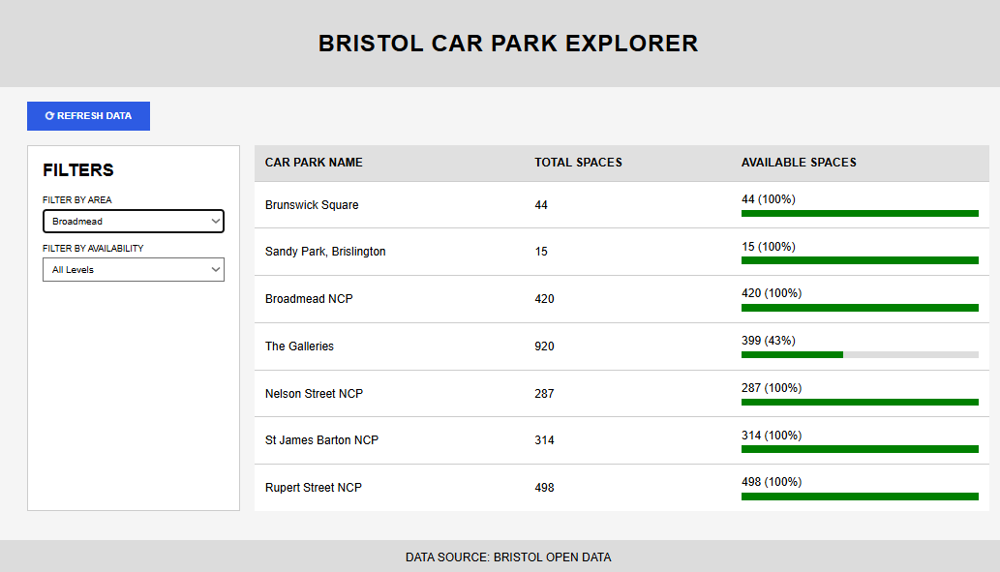

Introduction
In this stage, I developed the Bristol Car Park Explorer web application based on the design created in the previous stage. The system was implemented using HTML, CSS, and JavaScript. The aim was to create a working application that displays car park data in a clear and structured way.
The implementation follows a simple client-side approach and demonstrates the use of dynamic content rendering.

Technologies Used
HTML5 – used to structure the web page
CSS3 – used to style the layout and make it responsive
JavaScript – used to fetch data from the API and update the page dynamically
Fetch API – used to retrieve car park data from Bristol Open Data
GitHub – used for version control and project management
 

System Architecture

The application follows a simple client-side architecture
User → Browser → HTML/CSS/JS → API → JSON Data → Display
The browser loads the HTML page, which links to CSS for styling and JavaScript for functionality. JavaScript is responsible for retrieving and displaying data in the interface.

Component Diagram

The User interacts with the system through a web browser
The HTML file provides the page structure
The CSS file controls layout and styling
The JavaScript file handles logic and data processing
The API provides external data in JSON format


Component Structure
The system is divided into three main components:
HTML (index.html): defines the structure of the page
CSS (style.css): controls layout, colours, and responsiveness
JavaScript (app.js): handles API requests and dynamic updates


Implementation Details

The HTML file defines the layout of the web application. It includes:
A header displaying the application title
A refresh button for updating data
A filter panel for user input
A table to display car park information
A footer showing the data source

CSS Styling
CSS is used to create a structured layout and improve readability.
Flexbox is used to create a two-column layout consisting of a sidebar and a main content area.
Colours and spacing are applied to match the design created in the previous stage.

Data Fetching

The application uses the Fetch API to retrieve car park data from the Bristol Open Data API. When the page loads or the user clicks the refresh button the following function sends a request to the API and processes the response.

```javascript
async function loadData() {
    const response = await fetch(APIURL);
    const json = await response.json();
    allData = json.features.map(f => f.attributes);
    populateAreaFilter(allData);
    displayData(allData);
}
```


JavaScript Functionality
Bristol Open Data API provides car park data, including total spaces and occupancy. However, the occupancy field is not consistently updated in real time. As a result, available spaces are calculated based on the data returned by the API, which may indicate full availability for some car parks. This does not always reflect actual conditions, as many car parks do not have a live tracking system, meaning the data displayed may not be fully accurate.

The loadData function is used to display the car park data on the page. It clears the table first, then goes through each car park, works out the percentage of available spaces, and adds new rows to the table. This shows how JavaScript can be used to update the webpage using data.

```javascript
function loadData() {
    tableBody.innerHTML = "";

    data.forEach(car => {
        const percent = Math.round((car.available / car.total) * 100);

        const row = `
            <tr>
                <td>${car.name}</td>
                <td>${car.total}</td>
                <td>${car.available} (${percent}%)</td>
            </tr>
        `;

        tableBody.innerHTML += row;
    });
}
```

Event Handling

document.getElementById("refreshBtn").addEventListener("click", loadData);
This allows the user to refresh the displayed data.


Screenshots

The following screenshots show the Bristol car park Explorer web application running in a browser


This screenshot shows the homepage of the application when it first loads. It displays the full layout including the header, refresh button, filter panel, and the car park data table populated with real data from the Bristol Open Data API.


This screenshot shows the filter functionality in action. When the user selects a specific area from the filter panel, table updates and only shows the car parks that match the selected filter, demonstrating that the filtering feature works correctly


User Guide 
To run the application:
Open the project folder
Open index.html in a web browser
The data will load automatically
Click the “Refresh Data” button to update the displayed information


Design Consistency
The implemented system follows the design created in Stage 3.
The layout includes a sidebar filter panel, a main data table, and a refresh button.
The visual structure and positioning of elements match the wireframe and high-fidelity mockup.

Summary
In this stage I successfully developed a working web application using HTML, CSS, and JavaScript. The system fetches real car park data from the Bristol Open Data API and displays it clearly to the user. The implementation demonstrates the ability to build a functional front-end system based on earlier design stages.