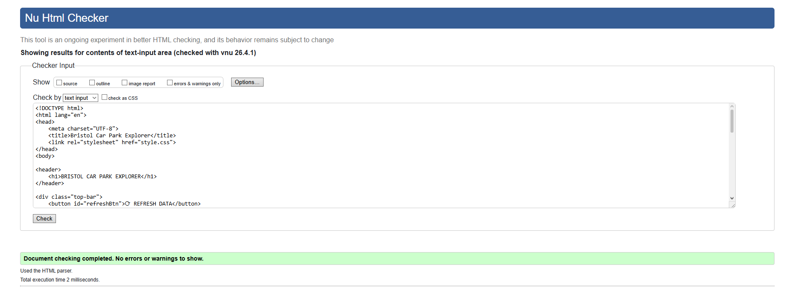

Introduction
In this stage, I tested the Bristol Car Park Explorer web application to make sure it works correctly and meets the requirements I set out earlier. I carried out functional tests, checked the interface on different browsers, and validated the HTML code.


Test Plan
Before carrying out the tests, I planned what needed to be checked to make sure the application met all of its requirements. The tests I planned to carry out were:

Check that the page loads correctly in a browser
Check that the data table displays real car park information from the API
Check that the refresh button reloads the data
Check that the filter dropdowns are visible and working
Check that the area filter correctly updates the table
Check that the availability filter correctly updates the table
Check that the layout works on different screen sizes
Check that the HTML passes W3C validation
Check that an error message appears if the data cannot be loaded

Test Results

T1 – Page loads in browser
I opened the application in a browser and the page loaded correctly without any errors.

T2 – Data table displays real API data
The car park data from the Bristol Open Data API loaded and displayed correctly in the table, showing car park names, total spaces, and available spaces.

T3 – Refresh button works
I clicked the refresh button and the data reloaded correctly without any issues.

T4 – Filter dropdowns visible
Both filter dropdowns appeared correctly in the sidebar panel as expected.

T5 – Area filter works
I selected a specific area from the area filter dropdown and the table updated correctly to show only car parks from that area.

T6 – Availability filter works
I selected the available only option from the availability filter and the table updated correctly to show only car parks with available spaces.

T7 – Responsive layout
I tested the layout by right clicking the page and selecting Inspect, then switching to mobile view using the device toolbar. The page content was visible but the layout did not fully adapt to the smaller screen size. This is a known limitation of the current version and would be improved in a future version by adding media queries to the CSS.

T8 – HTML validation
I pasted the HTML code into the W3C validator and the results showed no major errors.

T9 – Error handling
I tested this by setting the browser to offline mode using developer tools. The table displayed the message "Failed to load data. Please try again." as expected.


Requirements Traceability Matrix

F1 – Fetch car park data from the Bristol Open Data API was tested in T2 and passed.

F2 – Display car park name, total spaces, and available spaces was tested in T2 and passed.

F3 – Refresh button reloads data was tested in T3 and passed.

F4 – Filter by area and availability was tested in T5 and T6 and passed.

F5 – Show error if API is unavailable was tested in T9 and passed.

NF1 – Page loads within a few seconds was tested in T1 and passed.

NF2 – Responsive on different screen sizes was tested in T7. The layout was visible on smaller screens but did not fully adapt. This is identified as a limitation and would be addressed in a future version using CSS media queries.

NF3 – HTML passes W3C validation was tested in T8 and passed.


HTML Validation

I validated my HTML using the W3C Markup Validation Service at https://validator.w3.org The code was tested by pasting the contents of index.html directly into the validator. The results showed no major errors.



Browser Compatibility
I tested the application in the following browsers to make sure it displayed and worked correctly on each one.

Browser  Result:
Google Chrome  Pass 
Mozilla Firefox  Pass 
Microsoft Edge  Pass 

The layout and functionality worked correctly across all three browsers tested.


Debugging
During development I encountered a small number of issues which I identified and resolved before final submission.

One issue was that the table was not clearing before new data was inserted, which caused rows to duplicate when the refresh button was clicked. I fixed this by clearing the table body before inserting new rows:

```javascript
tableBody.innerHTML = "";
```

Another issue was that the filter dropdowns were not connected to the JavaScript because they were missing id attributes in the HTML. I fixed this by adding the correct id values to each select element so the JavaScript could find them.


Summary
The majority of tests passed and the HTML was validated successfully using the W3C validator. The only limitation identified was the responsive layout on mobile screens, which would be addressed in a future version.